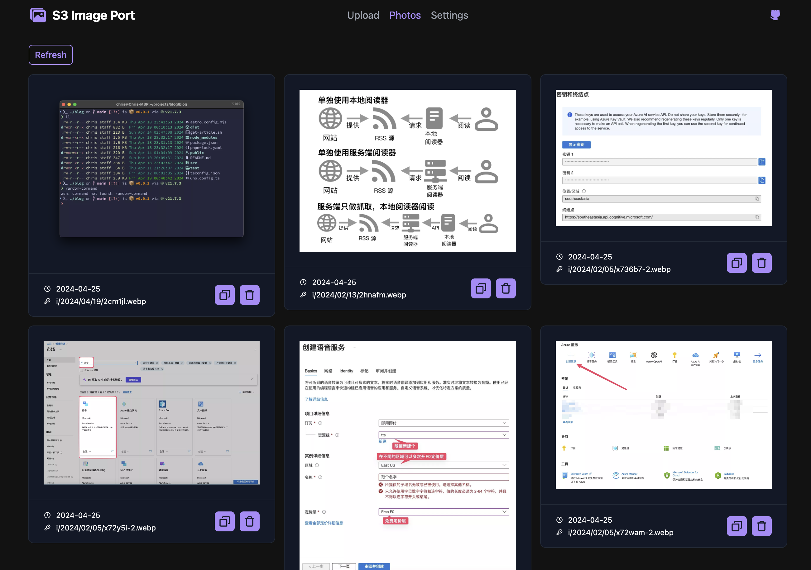

# S3 Image Port

<a href="README.md">English</a>
·
<a href="./doc/readme_zh.md">简体中文</a>

A custom front-end panel designed to manage images hosted on **S3-like** storage services (e.g. Cloudflare R2), where traditionally no dedicated image management panel exists. This solution provides a simple yet powerful interface for **uploading**, **managing**, and **integrating** images into your projects.

## Live Instance and Deployment

A public instance is hosted at [Vercel](https://vercel.com) and can be accessed at [iport.yfi.moe](https://iport.yfi.moe). You can start using it immediately by entering your specific S3 settings under the Settings tab.

While it is open-source and all your data remains in your local browser without being uploaded., you have the option to fork the repository and deploy it on your own Vercel account or server.

## Features

- :cloud: **Upload Photos:** Upload images with options to convert formats before uploading.
- :framed_picture: **Display Image List:** View a gallery of all uploaded images.
- :link: **Copy Image Links:** Easily copy direct and markdown formatted image links.
- :wastebasket: **Delete Images:** Remove images from storage directly through the panel.

The interface is fully responsive and works seamlessly on mobile devices as well.

## Usage

Before using the application, configure your S3 settings in the Settings tab. Required fields include the S3 endpoint, bucket name, region, and two keys (access key and secret key). Optional advanced settings like setting a public URL format are available if your S3 bucket uses a custom domain.

For obtaining S3 related keys, please refer to the documentation of your storage service provider. For instance, for R2 buckets managed under Cloudflare, keys are available under the "Manage API Tokens" section. Note that you will need the "Access Key ID" and "Secret Access Key", not the "Token Value" provided by Cloudflare.

## Feedback and Contributions

Feel free to raise an [Issue](https://github.com/yy4382/s3-image-port/issues/new/choose) if you encounter any problems or have suggestions.
If you have ideas for new features, don’t hesitate to create an [Issue](https://github.com/yy4382/s3-image-port/issues/new/choose)for those as well—no idea is too far-fetched!

## Known Issues / Roadmap

- [x] Customize upload key
- [ ] Image preview before upload
- [ ] Not able to fetch all image if there are more than 1000 objects in the bucket
- [x] Distinguish image files from other files
