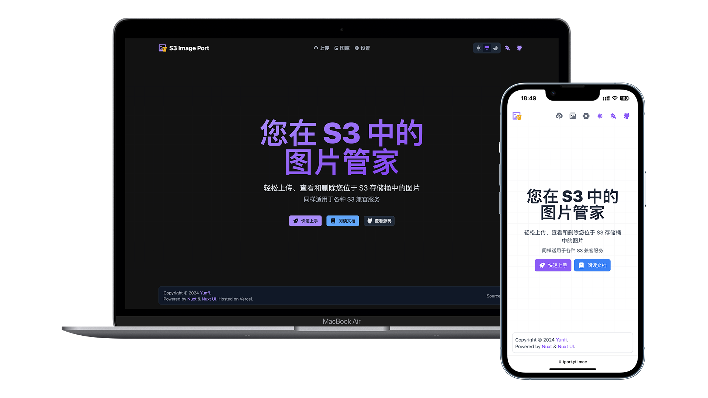
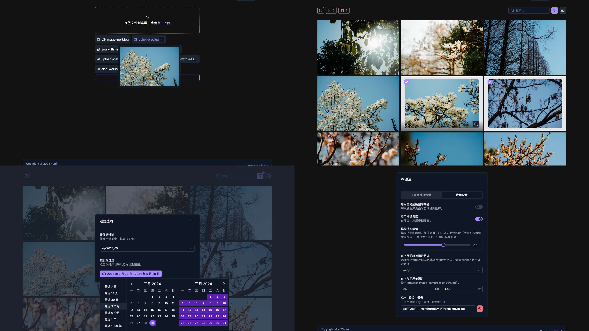

# S3 Image Port

[English](/README.md) · [简体中文](/docs/README-zh.md)

这是一个定制的前端面板，用于管理托管在**类 S3**存储服务（如 Cloudflare R2）上的图片。传统上这些存储服务没有专门的图片管理面板，该解决方案为图片的**上传**、**管理**和**集成**提供了一个简单而强大的界面。

## 在线实例和部署

一个公共实例托管在 [Vercel](https://vercel.com)，可通过 [iport.yfi.moe](https://iport.yfi.moe)访问。您只需在 “设置 ”选项卡下输入特定的 S3 设置，即可立即开始使用。

该项目是开源的，并且一切数据都留在您本地的浏览器中不会被上传，您也可以选择 Fork 本仓库，将其部署到自己的 Vercel 账户或服务器上。

## 特性和功能

- :cloud: **上传图片**：轻松上传您的图片，支持上传前压缩及格式转换。
- :framed_picture: **图库**：在图库中浏览和查找所有您已经上传的图片，支持丰富的过滤选项。
- :link: **复制图片地址**：只需一次点击，就可以复制图片的纯链接或 Markdown 格式链接。
- :wastebasket: **删除图片**：在管理面板中快速删除您已上传的图片。

该管理面板是完全响应式的，在移动设备上也能无缝运行。

## 使用方法

在使用本面板前，请在 “设置” 选项卡中配置 “S3 存储桶设置”。必填字段包括 `Endpoint`、`Bucket Name`、`Region` 和两个密钥（`Access Key ID` 和 `Secret Access Key`）。如果 S3 存储桶使用的是自定义域，则可以使用可选的高级设置，如设置 `Public URL`。

关于获取 S3 相关密钥，请参考存储服务提供商的文档。如果您使用的是 Cloudflare R2 Storage，可以查看文档站的 [Cloudflare R2 逐步指南](https://docs.iport.yfi.moe/zh/guide/for-cloudflare-r2)。

然后，您可以在一定程度上自定义此应用面板了。进入 "应用设置 "页面，您可以配置一些重要选项。特别地，如果您要修改 Key 模板，请仔细阅读[关于 `Key（路径）模板` 的特别说明](#关于-key路径模板-的特别说明)。

### 关于 `Key（路径）模板` 的特别说明

> [!CAUTION]
> 修改此选项的风险自负！如果新键值与现有键值冲突，现有文件将被**覆盖**。

该选项提供了一种自定义存储桶中上传图片的路径的方法，也称为 `Key`。默认情况下，它的值是 `i/{{year}}/{{month}}/{{day}}/{{random}}.{{ext}}`，也就是说，如果你在 2024-05-15 上传了一张 `png` 图片，那么图片在存储桶中的相对路径可能是 `i/2024/05/15/kgj7e-1z.png`。

可用的占位符（或变量）包括 `year`, `month`, `day`, `random`, `filename` 和 `ext`。它们应该用 <code v-pre></code> 括起来，否则无法被动态解析。

随机占位符 `random` 并非是完全随机的。它将 0:00 开始的毫秒数和一个两位数的随机数连接起来生成数值。因此，建议将此占位符配合年、月和/或日占位符一起使用。

## 反馈和贡献

如果您遇到任何问题或有任何建议，请随时提出 [Issue](https://github.com/yy4382/s3-image-port/issues/new/choose)。

如果您有关于新功能的想法，也可以创建一个 [Issue](https://github.com/yy4382/s3-image-port/issues/new/choose)，任何想法都不会太牵强！
